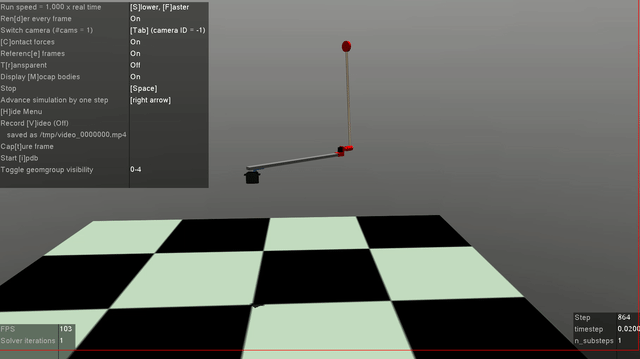

# PendulumRSim

Simulator for a real-world implementation of a swing up pendulum using OpenAI gym interface.

Based on this real-world implementation [https://github.com/rl-sensors/pendulum-r-esp32](https://github.com/rl-sensors/pendulum-r-esp32).

## Installation

    python setup.py install

### Prereqs
Requires MuJoCo physics engine to be installed.

[https://github.com/openai/mujoco-py](https://github.com/openai/mujoco-py)

Please follow the full installation instruction (not just pip install...).

## Use

    import gym
    import pendulum_r_sim.envs

    env = gym.make('PendulumRSim-v0')
    # or for the discrete actions version
    env = gym.make('PendulumRSimDisc-v0')

    # for the versions with delays
    env = gym.make('PendulumRSimPostDelayed-v0')
    # or 
    env = gym.make('PendulumRSimPostDelaysInObs-v0')

### Delayed Environments
The post-delays are implemented by running the action for 6 frameskips, collecting the observations and then running the action for another 0 - 2 frameskips.
This way the observations are delayed by that random number of frameskips.
Each frameskip is 5ms.

In `PendulumRSimPostDelaysInObs-v0`, this number of random frameskips is included in the state observations.

These settings can be changed by calling the constructor directly:

    env = PendulumRSimEnv(frame_skip=6, 
                enable_pre_delay=False, 
                max_pre_delay=0,
               enable_post_delay=True, max_post_delay=3,
               delay_in_observation=True)
               delay_in_observation=True)
